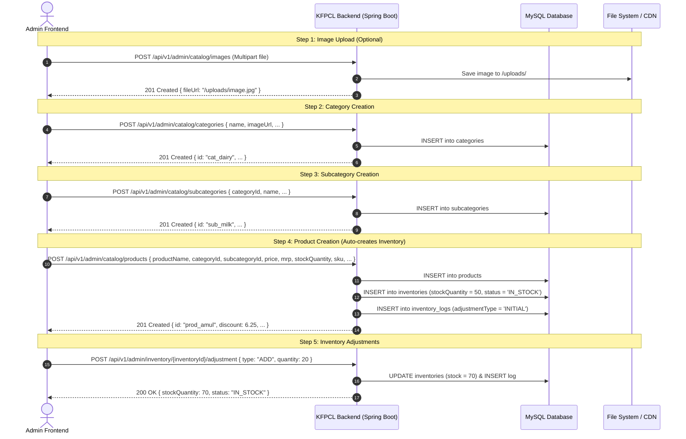
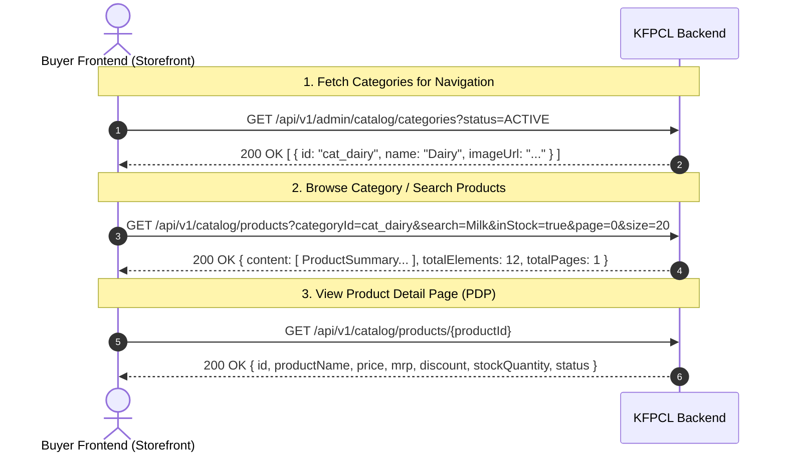

# KFPCL Frontend Integration Guide & API Flow

This document provides frontend engineers (React, Next.js, Vue, Angular, or Mobile) with complete specifications, workflow diagrams, TypeScript interfaces, and endpoint details to integrate with the **KFPCL Catalog, Product, and Inventory Backend**.

---

## 🏗️ 1. Architecture & Workflow Diagrams

### Admin Flow: Image Upload ➡️ Category ➡️ Subcategory ➡️ Product & Inventory



---

### Buyer Flow: Storefront Discovery & Search



---

## 💻 2. TypeScript Data Interfaces

Frontend developers can copy and paste these TypeScript interfaces into their project:

```typescript
// Standard API Envelope
export interface ApiResponse<T> {
  success: boolean;
  message: string;
  data: T;
  timestamp?: string;
  error?: string;
}

// Paginated Response
export interface PageResponse<T> {
  content: T[];
  page: number;
  size: number;
  totalElements: number;
  totalPages: number;
  last: boolean;
}

// Category
export interface Category {
  id: string;
  name: string;
  imageUrl?: string;
  description?: string;
  displayOrder: number;
  discount?: number;
  status: 'ACTIVE' | 'INACTIVE' | 'ARCHIVED';
  createdAt?: string;
  updatedAt?: string;
}

// Subcategory
export interface Subcategory {
  id: string;
  categoryId: string;
  categoryName?: string;
  name: string;
  imageUrl?: string;
  description?: string;
  displayOrder: number;
  discount?: number;
  status: 'ACTIVE' | 'INACTIVE' | 'ARCHIVED';
  createdAt?: string;
  updatedAt?: string;
}

// Product
export interface Product {
  id: string;
  productName: string;
  categoryId: string;
  categoryName?: string;
  subcategoryId: string;
  subcategoryName?: string;
  brand?: string;
  description?: string;
  imageUrl?: string;
  price: number;
  mrp: number;
  discount: number; // Server-calculated: ((mrp - price) / mrp) * 100
  quantity: number;
  unit: string;
  stockQuantity: number;
  status: 'ACTIVE' | 'INACTIVE' | 'OUT_OF_STOCK' | 'ARCHIVED';
  sku: string;
  createdAt?: string;
  updatedAt?: string;
}

// Inventory
export interface Inventory {
  id: string;
  productId: string;
  productName: string;
  sku: string;
  stockQuantity: number;
  reservedQuantity: number;
  availableQuantity: number;
  reorderLevel: number;
  status: 'IN_STOCK' | 'LOW_STOCK' | 'OUT_OF_STOCK';
  createdAt?: string;
  updatedAt?: string;
  recentLogs?: InventoryLog[];
}

// Inventory Audit Log
export interface InventoryLog {
  id: string;
  inventoryId: string;
  productId: string;
  adjustmentType: 'INITIAL' | 'ADD' | 'SUBTRACT' | 'SET' | 'DAMAGE' | 'RETURN' | 'SALE' | 'CORRECTION';
  quantity: number;
  previousQuantity: number;
  newQuantity: number;
  reason?: string;
  adjustedBy?: string;
  createdAt: string;
}
```

---

## 🛡️ 3. Frontend Form Validation Rules

| Field | Rule | Error Condition |
| :--- | :--- | :--- |
| **Product Price vs MRP** | `price <= mrp` | `422 Unprocessable Entity` (Selling price cannot exceed MRP) |
| **Price & MRP** | Positive numbers ($> 0$) | `400 Bad Request` |
| **Product SKU** | Unique alphanumeric | `409 Conflict` (Duplicate SKU detected) |
| **Category Name** | Unique string | `409 Conflict` (Category with name already exists) |
| **Stock Deduction** | `quantity <= currentStock` | `422 Unprocessable Entity` (Cannot reduce stock below 0) |

---

## 🚀 4. Ready-to-Use API Client Service (Axios / Fetch)

```typescript
import axios from 'axios';

const api = axios.create({
  baseURL: process.env.NEXT_PUBLIC_API_URL || 'http://localhost:8080/api/v1',
  headers: {
    'Content-Type': 'application/json',
  },
});

export const CatalogApi = {
  // 1. Images
  uploadImage: async (file: File) => {
    const formData = new FormData();
    formData.append('file', file);
    const { data } = await api.post('/admin/catalog/images', formData, {
      headers: { 'Content-Type': 'multipart/form-data' },
    });
    return data.data; // { fileUrl: string, fileName: string }
  },

  // 2. Categories
  createCategory: async (payload: { name: string; description?: string; imageUrl?: string; displayOrder?: number; discount?: number; isActive?: boolean }) => {
    const { data } = await api.post('/admin/catalog/categories', payload);
    return data.data;
  },
  getCategories: async (page = 0, size = 50) => {
    const { data } = await api.get(`/admin/catalog/categories?page=${page}&size=${size}&sortBy=displayOrder&sortDir=ASC`);
    return data.data;
  },

  // 3. Subcategories
  createSubcategory: async (payload: { categoryId: string; name: string; description?: string; imageUrl?: string; displayOrder?: number; isActive?: boolean }) => {
    const { data } = await api.post('/admin/catalog/subcategories', payload);
    return data.data;
  },
  getSubcategoriesByCategory: async (categoryId: string) => {
    const { data } = await api.get(`/admin/catalog/categories/${categoryId}/subcategories`);
    return data.data;
  },

  // 4. Products
  createProduct: async (payload: Omit<Product, 'id' | 'discount' | 'createdAt' | 'updatedAt'>) => {
    const { data } = await api.post('/admin/catalog/products', payload);
    return data.data;
  },
  getAdminProducts: async (page = 0, size = 10, search?: string) => {
    const params = new URLSearchParams({ page: String(page), size: String(size) });
    if (search) params.append('search', search);
    const { data } = await api.get(`/admin/catalog/products?${params.toString()}`);
    return data.data;
  },

  // 5. Inventory
  getInventoryList: async (page = 0, size = 10, search?: string) => {
    const params = new URLSearchParams({ page: String(page), size: String(size) });
    if (search) params.append('search', search);
    const { data } = await api.get(`/admin/inventory?${params.toString()}`);
    return data.data;
  },
  getInventoryById: async (inventoryId: string) => {
    const { data } = await api.get(`/admin/inventory/${inventoryId}`);
    return data.data;
  },
  adjustStock: async (inventoryId: string, payload: { adjustmentType: string; quantity: number; reason: string; adjustedBy: string }) => {
    const { data } = await api.post(`/admin/inventory/${inventoryId}/adjustment`, payload);
    return data.data;
  },

  // 6. Buyer Storefront
  getStoreProducts: async (filters: { categoryId?: string; search?: string; inStock?: boolean; minPrice?: number; maxPrice?: number; page?: number; size?: number }) => {
    const { data } = await api.get('/catalog/products', { params: filters });
    return data.data;
  },
  getStoreProductById: async (productId: string) => {
    const { data } = await api.get(`/catalog/products/${productId}`);
    return data.data;
  },
};
```
